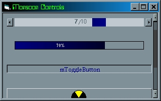



## Monsoon Controls

### Description

I first made these controls for NAVEN(the game i am making, search for it on psc), but am now just adding any controls i need for my newest apps, this will probably be my last submission for awhile because i am working on a IDE for 10 languages(hope i finish it), which i will post on psc(probably). this set of controls includes a scrolling container, a gradient label, a fairly unique horizontal scroller(look at it and you will see why there is no vertical one), a gradient progressbar, a system button, a toggle button, a flat button, and a ton of API calls that i will use in the next version of this(a few new controls that i am working on use them). hope you ppl like this.
 
### More Info
 
There are currently two known errors, if you can find out how to fix them or find more please email me at cory@geesaman.com. Both errors i know of have to do with storing and retreiving data from the propbag; the first error is in the container, it will not let you change the backcolor for some reason; the second error is in the hscroller, it does not let you change the forecolor. I have looked for the past few hours and cannot find the cause(it is probably too obvious i am overlooking it, so i thought maybee someone else may have a different perspective on my code). Even if you can't fix this for yourself they are still very good controls and are definatly usable.

             |
---                |---
**Submitted On**   |2001-07-01 22:58:14
**By**             |[Cory J\. Geesaman](https://github.com/Planet-Source-Code/PSCIndex/blob/master/ByAuthor/cory-j-geesaman.md)
**Level**          |Intermediate
**User Rating**    |4.2 (21 globes from 5 users)
**Compatibility**  |VB 5\.0, VB 6\.0
**Category**       |[Custom Controls/ Forms/  Menus](https://github.com/Planet-Source-Code/PSCIndex/blob/master/ByCategory/custom-controls-forms-menus__1-4.md)
**World**          |[Visual Basic](https://github.com/Planet-Source-Code/PSCIndex/blob/master/ByWorld/visual-basic.md)
**Archive File**   |[Monsoon Co22037712001\.zip](https://github.com/Planet-Source-Code/cory-j-geesaman-monsoon-controls__1-24639/archive/master.zip)

